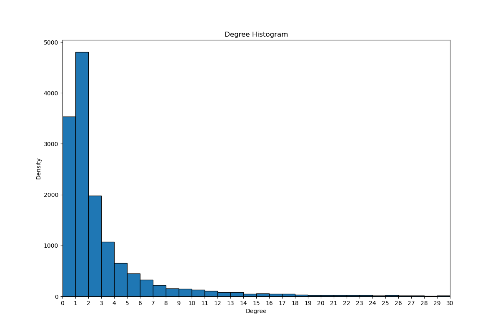
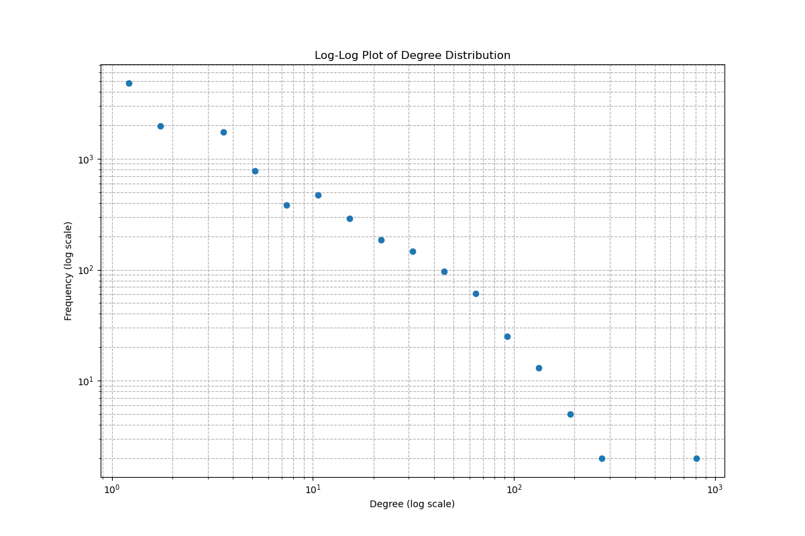

# Social Network Analysis of derStandard.at

An analysis of how ~16,000 users of Austria's largest online newspaper interact — who follows whom, who replies to whom, and who upvotes or downvotes whose comments. The project examines whether user behavior is driven by homophily (birds of a feather) or whether interactions cross demographic and structural boundaries.

---

## Overview

This project builds and analyzes three distinct interaction networks from derStandard.at community data (May 2019):

| Network | Edges | Type | Question |
|---|---|---|---|
| **Follow/Ignore** | ~54K follows, ~27K ignores | Directed | Do users preferentially follow same-gender or same-age peers? |
| **Reply-to** | ~739K postings across 7 channels | Directed, weighted | Does reply behavior cluster by topic or user attribute? |
| **Votes** | ~292K votes across 7 channels | Undirected, weighted | Do like/dislike patterns reveal hidden communities? |

---

## Dataset

Raw data covers May 1–31, 2019. Five CSV files (~61 MB total):

```
data/raw/
├── Following_Ignoring_Relationships_01052019_31052019.csv   (86,777 rows)
├── Postings_01052019_15052019.csv                           (29,838 rows)
├── Postings_16052019_31052019.csv                           (30,268 rows)
├── Votes_01052019_15052019.csv                              (145,820 rows)
└── Votes_16052019_31052019.csv                              (146,044 rows)
```

**Download:** [Google Drive](https://drive.google.com/drive/folders/1wR5MG_6e9N2zGjDVUyxawp_wJ1NSilE-) → place files into `data/raw/`

A consolidated `user.csv` (16,479 unique users with gender and account age) is already included in `data/processed/` and does not need to be regenerated.

---

## Analysis

### `follows.ipynb` — Follow & Ignore Network
- Constructs directed graphs from 53,969 follow and 26,511 ignore edges (after removing self-loops)
- Computes degree distribution, clustering coefficient, and assortativity
- Fits a power-law to in-degree distribution
- Extracts a high-degree subgraph (≥30 connections) for visualization

### `votes.ipynb` — Voting Networks
- Builds separate like/dislike networks for 7 article channels (Inland, Sport, Kultur, Wirtschaft, Bildung, Familie, Karriere)
- Measures gender, age, and degree assortativity per channel
- Compares mixing patterns across topics

### `postings.ipynb` — Reply-to Networks
- Builds weighted directed graphs where edge weight = number of replies between two users
- Analyzes reply-to assortativity by gender, age, and degree across 7 channels

---

## Key Findings

- **Power-law degree distribution in the follow network:** A small number of users attract a disproportionate share of followers, confirmed by a log-log linear fit. The top nodes act as hubs in an otherwise sparse graph (average clustering = 0.032).

- **Disassortative mixing by degree:** Popular users are not followed by other popular users — degree assortativity is −0.118 in the follow network and −0.217 in the ignore network. High-degree accounts attract connections from low-degree periphery users.

- **Weak but measurable age homophily in following:** Users show a slight tendency to follow similarly-aged accounts (r = 0.123), but the effect is small. Gender homophily is even weaker (r = 0.085).

- **Voting behavior is essentially attribute-blind:** Gender and age assortativity in both like and dislike networks hover near zero across all seven article channels. Who you upvote or downvote is not predicted by shared demographics.

- **Blocking is more individualistic than following:** The ignore network has lower clustering (0.007 vs. 0.032) and stronger disassortativity than the follow network, suggesting that blocking decisions are personal rather than community-driven.

---

## Visualizations

**In-degree distribution of the follow network** — right-skewed, consistent with a power-law:



**Log-log plot confirming power-law behavior** — linear trend on a log-log scale:



**High-degree subgraph (users with ≥ 30 connections)** — node size scaled by in-degree:


---

## Quickstart

```bash
# 1. Clone and install dependencies
git clone <repo-url>
cd sna-project
pip install -r requirements.txt
pip install -e .

# 2. Download raw data (see Dataset section above)

# 3. (Optional) Regenerate the user attribute table
python src/data/make_user_dataset.py

# 4. Run the notebooks
jupyter notebook notebooks/exploratory/follows.ipynb
jupyter notebook notebooks/exploratory/votes.ipynb
jupyter notebook notebooks/exploratory/postings.ipynb
```

---

## Tech Stack

- **NetworkX** — graph construction, assortativity coefficients, clustering, degree analysis
- **pandas** — data loading, merging, and preprocessing
- **matplotlib** — degree distribution plots, log-log power-law visualization, network layout rendering
- **numpy** — numerical utilities

**Key NetworkX functions used:**
`nx.DiGraph`, `nx.degree_assortativity_coefficient`, `nx.attribute_assortativity_coefficient`, `nx.numeric_assortativity_coefficient`, `nx.average_clustering`, `nx.draw_spring`

---

## Repository Structure

```
sna-project/
├── data/
│   ├── raw/                        ← place downloaded CSVs here
│   └── processed/
│       └── user.csv                ← pre-generated, 16,479 users
├── notebooks/
│   └── exploratory/
│       ├── follows.ipynb
│       ├── votes.ipynb
│       └── postings.ipynb
├── reports/
│   └── figures/follows/            ← generated network visualizations
├── src/
│   ├── data/make_user_dataset.py
│   └── features/util.py            ← calculate_key_figures() helper
├── requirements.txt
└── README.md
```